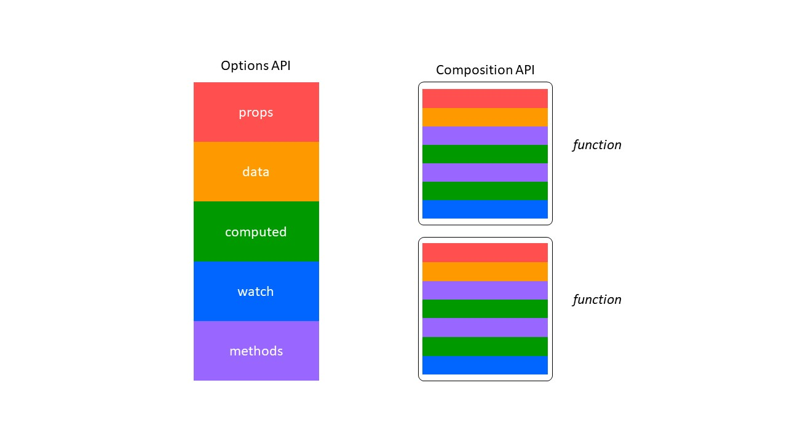

# How to make REUSABLE Dynamic Web TWAIN module with Composition API of Vue.js

Composition API is a new feature of Vue.js 3. Though it is designed for Vue.js 3, it is compatible with Vue.js 2.x. To resolve the reusability issue in Vue.js 2.x, Composition API organizes data and logics in functions. This change makes data and logics mixed altogether instead of splitting into respective parts. In this article, we would demonstrate the usage of Composition API with Dynamic Web TWAIN.

## Issues with Options API of Vue.js 2.x

### Readability and Maintainability

Options API organizes data and logics into several sections: `props`, `data`, `computed`, `watch`, `methods`, etc.. When the application scale is not large, the code is manageable. If the scale goes large, it is more often to scroll up and down to jump between methods and data sections. As a sequence, the readability is bad and possibly resulting in difficulty in finding bugs.



### Reusability and Maintainability

In Vue.js 2.x, there are three ways to wrap the similar logics into a module, they are **mixin**, **directive**, and **renderless component**. Definitely, these methodologies do extract the similar logics into one piece and avoid repeating the similar code for multiple times. However, they are not ideal for encapsulation. One of the serious issues is: **mixing the same part from multiple sources altogether**. Though the readability problem is resolved, the data origins are possibly blurred, especially when number of mixins and the lines of code are large.

## Composition API

Composition API divides the manageable unit into further lower pieces: **function**. Instead of defining an object, Composition API allows developers to mix their data and logic into one or several functions. Then, assembling these functions into a component to implement the required functionalities. 

## Implementation with Composition API

### Preparation

To try with Composition API, we would create our application based on Vue.js 3.

```bash
vue create vue3-dwt
```

We add TypeScript support to our project. The better support of TypeScript is another main feature of Vue.js 3. We highly recommend our reader to start coding with TypeScript. We do provide the definition of Dynamic Web TWAIN library, which is a TWAIN SDK for web development. Refer to the [Dynamic Web TWAIN homepage](https://www.dynamsoft.com/Products/WebTWAIN_Overview.aspx) for more details. Also, don't forget to get a trial license if you have never tried Dynamic Web TWAIN.

Use the following commands to install `dwt` and its type definition.

```bash
npm install --save dwt
npm install --save-dev @types/dwt
```

Regarding the integration with Dynamic Web TWAIN, there is no change compared to that in Vue.js 2.x. The previous method is applicable in Vue.js 3 projects. Install `ncp` to help us copy the resource files to `public` folder.

```bash
npm install --save-dev ncp
```

Then, edit the `package.json` to copy before the `serve` or after the `build`.

```json
// package.json
{
  // ...
  "scripts": {
    "serve": "ncp node_modules/dwt/dist public/dwt-resources && vue-cli-service serve",
    "build": "vue-cli-service build && ncp node_modules/dwt/dist public/dwt-resources",
    "lint": "vue-cli-service lint"
  },
  //...
}
```

### Design

We hope to implement a function that
1. accepts arguments to configure the WebTWAIN environment
2. initializes the web twain environment and create a dwt instance
3. returns the created DWT object

As WebTWAIN environment has numerous parameters, it is infeasible to expose them respectively via the arguments of function. We wrap the environment parameters into an object. At the time of initialization, we pass the config object, the creation mode indicator, and the id of dwt instance as the arguments.

```ts
interface DWTEnvConfig {
    Containers?: Container[];
    IfAddMD5UploadHeader?: boolean;
    IfConfineMaskWithinTheViewer?: boolean;
    IfUseActiveXForIE10Plus?: boolean;
    ProductKey: string;
    ResourcesPath: string;
    UseCameraAddonWasm?: boolean;
    UseLocalService?: boolean;
}

function useDwt(config: DWTEnvConfig, id: string, createEx: boolean) { }
```

Since the initialization process keeps the same among projects, we tend to maintain the initialization locally and do not expose to the outside environment. 

The initialization process is shown as the following diagram.

```flow
unmount=>operation: Delete the dwtObj with corresponding id
mount=>operation: Specify WebTWAIN environment
create=>operation: Create a dwt object

unmount->mount->create
```

We define a function for each stage.

```ts
interface DWTInitResult {
    status: boolean;
    reason: string;
}

function _unmountDwt(id: string): Promise<DWTInitResult> { }
function _mountDwt(id: string): Promise<DWTInitResult> { }
function _createDwtObj(id: string, createEx: boolean): Promise<WebTwain> { }
```

Finally and most importantly, we return the created DWT instance to the calling component. This is the most differentiated step in comparison to direct return.

Vue.js monitors the change of data and take appropriate actions. In Vue.js 2.x, the data is registered in `data` section of Vue instance. However, Composition API is independent to the Vue instance. At the time of `setup` being invoked, the instance hasn't been created yet, let alone injecting to `data`. In Composition API, we need to create reactive proxies for the data, so that Vue.js could capture their change and update the view for us. Here, the common demand is getting the instance of DWT.

```ts
const dwtobj = ref(null as unknown as WebTwain)
```

The `ref` create a reactive proxy for `dwtobj` with initial value `null`. We cast it to the type `WebTwain` defined in `@types/dwt`.

### Accept The Arguments

We expose `useDwt` to the component. To initialize a dwt instance, configuration parameters are required. As we previously defined, we accept a configuration object, a id of type `string`, and headless indicator of type `boolean`.

```ts
export default function useDwt(config: DWTEnvConfig, id: string, createEx: boolean) {
    // Empty check
    if (!config) {
        throw new Error('empty config')
    }
}
```

### Initialization Process

Secondly, let's implement the initialization process.

```typescript
interface DWTInitResult {
    status: boolean;
    reason: string;
}

function _unmountDwt(id: string): Promise<DWTInitResult> {
    const env: WebTwainEnv = dwt.WebTwainEnv
    return new Promise<DWTInitResult>((res, rej) => {
        const status: boolean = env.DeleteDWTObject(id)
        if (status) {
            res({ status: true, reason: '' })
        } else {
            rej({ status: false, reason: 'Unmount dwt instance failed' })
        }
    })
}
```

```ts
async function _mountDwt(id: string): Promise<DWTInitResult> {
    return new Promise<DWTInitResult>((res, rej) => {
        
        const env: WebTwainEnv = dwt.WebTwainEnv
        
        res({ status: true, reason: '' })
    })
}
```

```ts
async function _mountDwt(id: string, createEx: boolean): Promise<WebTwain> {
    const unMountResult: DWTInitResult = await _unmountDwt(id)
    const env: WebTwainEnv = dwt.WebTwainEnv
    return new Promise((res, rej) => {
        if (!unMountResult.status) {
            console.error(unMountResult)
            rej(unMountResult)
        }
        if (createEx) {
            const config: DWTInitialConfig = {
                WebTwainId: id
            }
            env.CreateDWTObjectEx(config, (twain) => {
                console.log(twain)
                res(twain)
            }, (reason) => {
                  console.error(reason)
            })
        } else {
            const containers = [
                {
                    WebTwainId: id,
                    ContainerId: id,
                    Width: '100%',
                    Height: '100%',
                    bLocalService: true
                }
            ]
            env.Containers = containers
            env.OnWebTwainReady = (() => {
                res(env.GetWebTwain(id))
            }) as () => {}
            env.OnWebTwainNotFound = rej as () => {}
            env.Load()
        }
    })
}
```

Then, let's sequence the initialization process into a single function named `_init`.

```ts
async function _init(config: DWTEnvConfig, id: string, createEx: boolean): Promise<WebTwain> {
    const env = dwt.WebTwainEnv
    dwt.WebTwainEnv = Object.assign(env, config)
    let dwtObj!: WebTwain
    try {
        dwtObj = await _mountDwt(id, createEx)
    } catch (e) {
        console.error(e)
        return Promise.reject({ status: false, reason: 'create dwt object failed' })
    }
    return Promise.resolve(dwtObj)
}
```

### Built with Composition API

We call the `_init` in `mounted` in Vue.js 2.x. In Composition API, we use `onMounted` instead. We are expecting our script could get the scanner sources and choose the first one as the default scanner. The use of `watch` is to monitor the change of `activeScanner` and execute specified procedure in reaction to the change. `watch()` has the same functionality to `watch` in Options API.

```ts
import { ref, onMounted } from 'vue'

export default function useDwt(config: DWTEnvConfig, id: string, createEx: boolean) {
    if (!config) {
        throw new Error('empty config')
    }
    const dwtObj = ref(null as unknown as WebTwain)
    const scanners = ref([] as Scanner[])
    const activeScanner = ref(null as unknown as Scanner)
    const init = async () => {
        try {
            dwtObj.value = await _init(config, id, createEx)
            scanners.value = await _getScanners(dwtObj.value)
            activeScanner.value = scanners.value[0]
        } catch(reason) {
            console.error(reason)
        }
    }

    onMounted(init)

    watch(activeScanner, () => {
        const obj: WebTwain = dwtObj.value
        obj.SelectSourceByIndex(activeScanner.value.id)
    })

    return {
        dwtObj,
        scanners,
        activeScanner
    }
}
```

### Consume The Module In Component

To consume the module, we import the file and invoke `useDwt()` in `setup()`, which is a newly added hook in Vue.js 3. Similarly, we need to wrap the `props` with reactive proxies. `toRefs` converts the `props` to a reactive one, and destruct them via `{}`. Therefore, while passing the `props` to `useDwt()`, it is necessary to explicitly use the value of variables rather than the variables themselves.

```ts
import { defineComponent, toRefs } from 'vue'
import useDwt, { DWTEnvConfig } from '@/composable/useDwt'

const Component = defineComponent({
    name: 'dwt-composited',
    props: {
        license: {
            type: String,
            default: 'trial key'
        },
        resourcePath: {
            type: String,
            default: ''
        },
        webTwainId: {
            type: String,
            default: 'dwt-object'
        }
    },
    setup (props) {
        const { license, resourcePath, webTwainId } = toRefs(props)
        const config: DWTEnvConfig = {
            ProductKey: license.value,
            ResourcesPath: resourcePath.value
        }
        const createEx = false
        const { dwtObj, scanners, activeScanner } = useDwt(config, webTwainId.value, createEx)
        return {
            dwtObj: dwtObj,
            scanners: scanners,
            activeScanner: activeScanner
        }
    },
    data: () => ({

    }),
    methods: {

    }
})
export default Component
```

## Source Code

The entire project could be found at [Github: Dynamsoft/vue3-dwt]().

## Related Article

[How to Make a Component-based Document Scanning App](https://www.dynamsoft.com/codepool/vue-document-scanning-app.html)